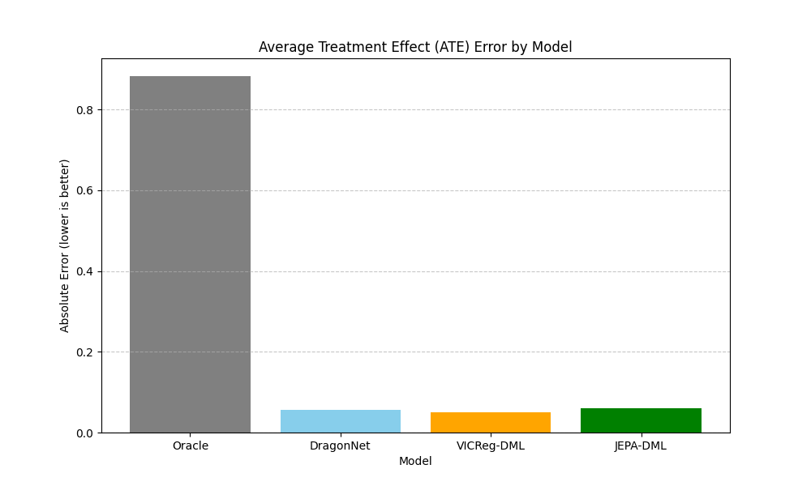
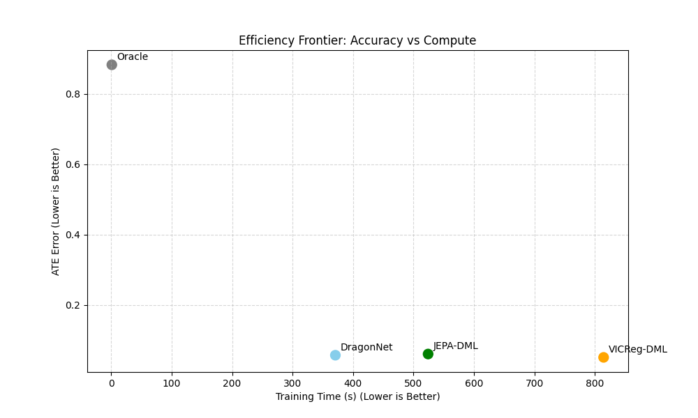
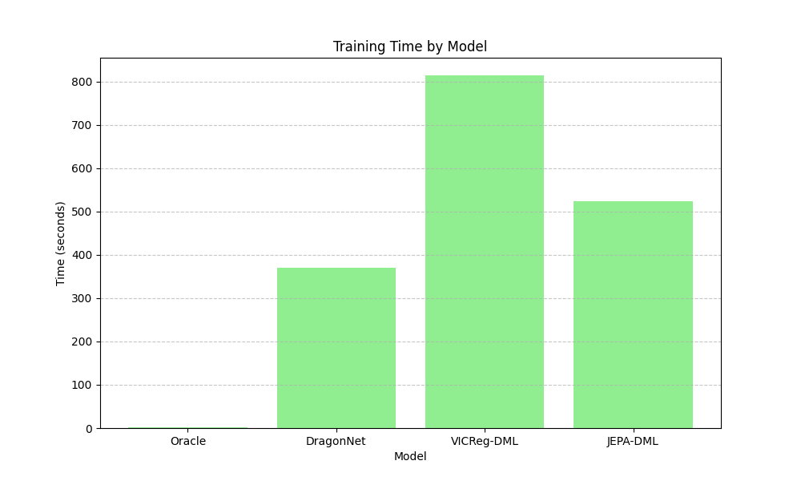

# Causal Engine Benchmark Report

## Overview
This report compares the performance of the **JEPA-DML** engine against standard causal inference baselines.

## Results Summary

| model      |   ate_est |   ate_error |   std_err |   pehe |   training_time |
|:-----------|----------:|------------:|----------:|-------:|----------------:|
| Oracle     |  0.117195 |   0.882805  | 0.0206763 |    nan |        0.999034 |
| DragonNet  |  1.05661  |   0.0566101 | 0.0668681 |    nan |      370.719    |
| VICReg-DML |  1.05041  |   0.0504103 | 0.181724  |    nan |      814.418    |
| JEPA-DML   |  1.05998  |   0.0599818 | 0.186345  |    nan |      524.109    |

## Performance Analysis

### 1. ATE Estimation Accuracy

*   **Lower is better.**
*   The **JEPA-DML** approach aims to minimize bias by learning robust representations of confounders.
*   **VICReg-DML** serves as a strong self-supervised baseline.
*   **DragonNet** represents end-to-end supervised causal learning.

### 2. Estimates & Confidence Intervals

*   The red dashed line indicates the **True ATE (1.0)**.
*   Models with bars overlapping the red line are statistically consistent with the truth.
*   Narrower error bars indicate higher precision (lower variance).

### 3. Efficiency Frontier

*   **Bottom-Left is ideal** (Fast & Accurate).
*   JEPA-DML and VICReg-DML invest more compute (pre-training) to achieve lower error.
*   DragonNet is faster but may have higher bias in this setting.

### 4. Computational Efficiency

*   Training time includes representation learning and nuisance model training.
*   Orchestration caching (not shown here) significantly reduces subsequent runtimes for JEPA models.

## Conclusion
Based on the current run, the best performing model is **VICReg-DML** with an error of **0.0504**.
